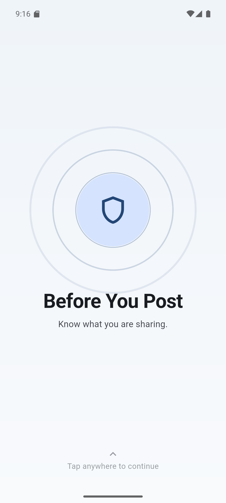
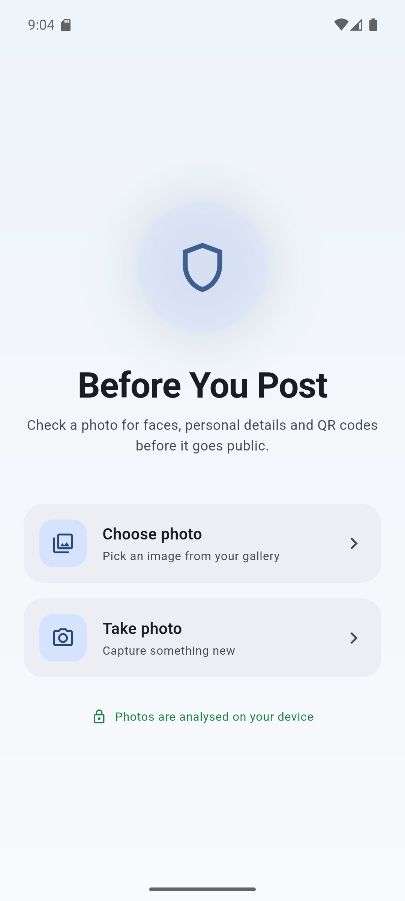
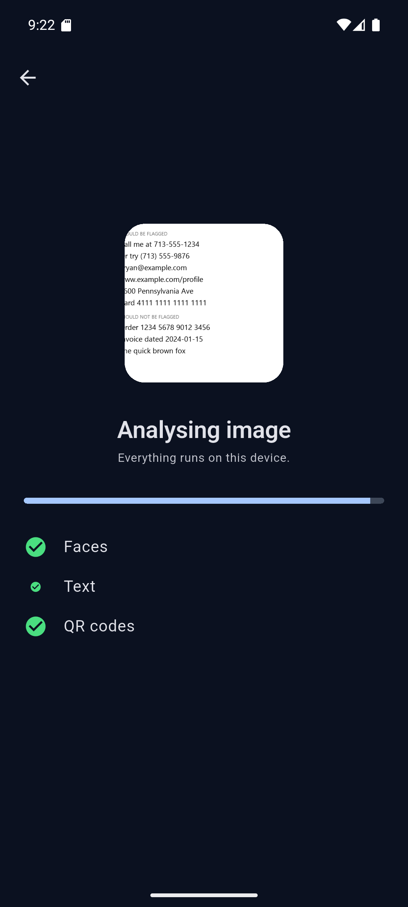
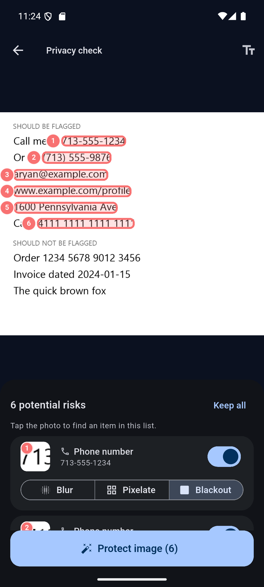
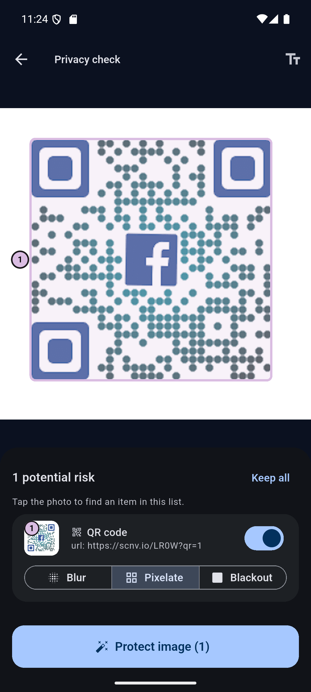
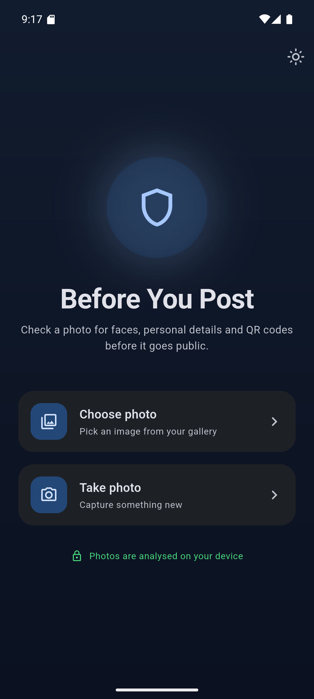
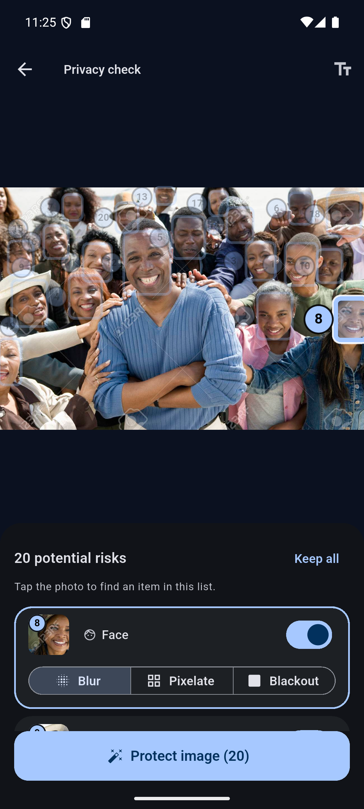
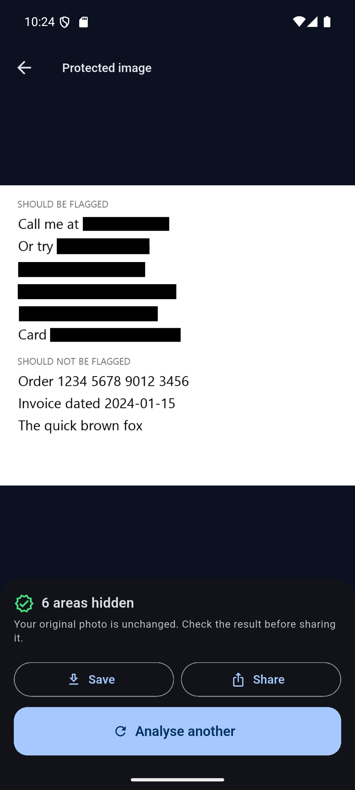

# Before You Post

**A privacy-first Android app that finds faces, personal details and QR codes in a photo entirely on-device, then lets you review and hide them before you share.**

Built with Flutter and Google ML Kit. No backend, no accounts, no image uploads.

---

## Screenshots

| Intro | Home | Analysis |
|:---:|:---:|:---:|
|  |  |  |
| Scan-pulse opening | Light theme | Per-detector progress |

| Findings — text | Findings — QR | Dark theme |
|:---:|:---:|:---:|
|  |  |  |
| Numbered boxes on exactly the sensitive spans | Decoded payload shown so you can judge it | Every screen themed from the same tokens |

| Picking one of many | The protected copy |
|:---:|:---:|
|  |  |
| Tapping face 8 dims the other 19 and scrolls to its card | Rendered once from the original |

> The findings screenshots use a deliberate test image. The six items under **SHOULD BE FLAGGED** are all caught; the three under **SHOULD NOT BE FLAGGED** are all correctly ignored, including a 16-digit order number that fails the Luhn check. In the protected copy, note that "Call me at" and "Card" survive — only the sensitive spans are hidden, not the whole line.

---

## Status

This is an **in-progress project**, and the README says what actually works today rather than what is planned.

| Capability | State |
|---|---|
| Pick a photo from the gallery or camera | ✅ Working |
| Face detection | ✅ Working |
| OCR + rule-based detection of phone numbers, emails, URLs, card numbers, addresses | ✅ Working |
| QR and barcode detection, with decoded payload shown | ✅ Working |
| Review each finding and choose hide / keep | ✅ Working |
| Choose blur / pixelate / blackout per finding | ✅ Working |
| **Redaction — renders a protected copy** | ✅ Working |
| Light + dark themes, persisted | ✅ Working |
| Manual drag-to-redact | ❌ Not built |
| Save / share the protected copy | ❌ Not built — those buttons on the result screen are visibly disabled |
| iOS support | ❌ Not configured (Android-only project) |

---

## The problem

A screenshot of a conversation can contain a phone number, a home address, a face and a QR code all at once. People share those images every day without noticing what is in the corner of the frame.

Existing tools either require uploading the image to a server — which is a strange thing to do with a photo you consider private — or leave the user to spot everything themselves.

**Before You Post** does the scan locally, shows what it found, and leaves the decision to the person holding the phone.

---

## How the detection pipeline works

Three independent detectors run **concurrently** on the same image, and their results merge into one list of findings.

```
                        IMAGE
                          │
        ┌─────────────────┼─────────────────┐
        │                 │                 │
  Face detection        OCR           QR / barcode
  (ML Kit)            (ML Kit)          (ML Kit)
        │                 │                 │
        │        Sensitive-text rules       │
        │        (regex + Luhn)             │
        │                 │                 │
        └─────────────────┼─────────────────┘
                          │
                   PRIVACY ENGINE
                          │
                    User review
                (hide / keep each item)
                          │
                  REDACTION ENGINE
                          │
                   Protected image
```

Two design decisions carry most of the weight:

**Reading text and judging text are separate problems.** `TextRecognitionService` knows how to read words and where they sit; it has no opinion about whether they are private. `SensitiveTextDetector` decides what is sensitive and never touches ML Kit. They fail in different ways and are debugged differently — an unflagged phone number is either an OCR miss or a rules miss, and those need opposite fixes. The debug toggle in the app bar draws every line OCR read, which tells you which of the two happened in about a second.

**The rules are deliberately deterministic.** Regex plus validation, not a model. Rules are readable, unit-testable without a device, and explainable when they get something wrong. NLP is a later version, not a starting point.

The Luhn checksum is what makes card detection usable at all. Without it, "any 13–19 digit run" flags order numbers, timestamps and tracking IDs constantly. Every real card number satisfies Luhn and a random digit run passes only about one time in ten.

Detector ordering is load-bearing: a 16-digit card number **also** satisfies the phone-number pattern, so cards are tested first. There is a test pinning that behaviour so a future reorder fails loudly.

---

## Architecture

```
lib/
├── main.dart                        App shell, themes, first screen
├── models/
│   └── privacy_finding.dart         The one shared data type
├── screens/
│   ├── intro_screen.dart            Tap anywhere to continue
│   ├── home_screen.dart             Choose / take photo
│   ├── analysis_screen.dart         Per-detector progress
│   ├── editor_screen.dart           Image + overlays + review list
│   └── result_screen.dart           The protected copy
├── services/
│   ├── privacy_engine.dart          Owns and merges every detector
│   ├── face_detection_service.dart
│   ├── text_recognition_service.dart
│   ├── qr_detection_service.dart
│   ├── sensitive_text_detector.dart
│   └── redaction_service.dart       Renders the protected copy
├── theme/
│   ├── app_theme.dart               Colour, spacing and motion tokens
│   └── theme_controller.dart        Persisted light/dark choice
├── utils/
│   └── regex_utils.dart             Patterns + Luhn
└── widgets/
    ├── detection_overlay.dart       Draws the numbered boxes
    ├── finding_card.dart            One reviewable finding
    ├── finding_style.dart           Icon and colour per finding type
    ├── region_thumbnail.dart        Crop of a finding, for its card
    └── fade_slide_in.dart           Staggered entrance animation
```

**Screens talk to `PrivacyEngine`, never to a detector directly.** Adding QR detection to a working face + OCR pipeline required one new service file and a handful of lines in the engine — no screen, model or widget changed.

**No ML Kit type escapes its own service.** Each detector translates its library's result into `PrivacyFinding` and nothing leaks past that boundary. That is what will make it possible to swap in a YOLO model for licence plates later without touching the UI.

**Findings are addressable, not just listed.** Twenty faces produce twenty rows all labelled "Face", which is unusable on its own. Each finding therefore carries a number drawn both on its box and on its card, and each card shows a thumbnail of the actual region cropped straight from the decoded image. Tapping a box on the photo dims the others and scrolls its card into view; tapping a card highlights its box. Without that, choosing which face to hide is trial and error.

**The redaction engine works from decoded pixels, not from the file.** It is handed the same RGBA buffer Flutter already decoded for display, rather than re-reading the image itself. Three things follow from that, and each was learned the hard way:

- It can protect **any format the phone can open** — AVIF and HEIC included, which `package:image` cannot decode at all. Decoding the file independently meant the app could display and analyse a photo it then refused to protect.
- A **palette (indexed-colour) PNG cannot silently defeat it.** In such an image a pixel holds an index, not a colour, so writing RGB into one changes nothing — redaction reported success and altered not a single pixel. There is no palette left by the time the engine sees the data.
- The pixels being edited are **byte-for-byte the ones the detectors measured**, so the two can never disagree about EXIF rotation.

### The invariant that matters

> `PrivacyFinding.bounds` is **always** in the original image's pixel coordinates — never screen or widget coordinates.

Every detector produces that space; only the drawing layer converts out of it. This is the single rule that keeps coordinate mapping tractable, and breaking it "just this once" is how half your rectangles end up in a different space with nothing in the type system to catch it.

The overlay avoids letterbox maths entirely by forcing the image container to the image's own aspect ratio with `AspectRatio`. With no black bars *inside* the box, the conversion collapses to one multiplication and zero offsets. `scaleX` and `scaleY` are still computed separately even though they are mathematically equal — if a future layout change breaks the aspect ratio, every box visibly **skews** rather than silently drifting.

---

## Technology stack

| Component | Choice | Why |
|---|---|---|
| Framework | Flutter 3.47.2 / Dart 3.13.2 | One codebase, good motion primitives |
| Face detection | `google_mlkit_face_detection` | On-device, free, no model to train |
| OCR | `google_mlkit_text_recognition` | On-device, returns text **and** its position |
| QR / barcodes | `google_mlkit_barcode_scanning` | Handles every common format, decodes the payload |
| Sensitive text | Regex + Luhn (hand-written) | Readable, testable, explainable |
| Image picking | `image_picker` | Gallery + camera, uses the Android photo picker |
| Redaction | `image` | Pure Dart, so the pixel work runs in an isolate |
| Preferences | `shared_preferences` | Theme choice only |
| Backend | **None** | See below |

Notably **not** used: `google_fonts`. It downloads font files from Google at runtime, which would contradict the "analysed on your device" line the app displays. If a custom typeface is added it will be bundled as an asset instead.

---

## Privacy design

The MVP performs all analysis locally. There is no upload, no account system, no analytics and no crash reporting.

The app's own wording is deliberately careful. The home screen says *"Photos are analysed on your device"* — a description of what it does — rather than *"your photos never leave your device"*, which is an absolute claim that would require auditing every dependency's behaviour first. ML Kit's models here run on-device, but that guarantee should be verified and stated precisely rather than assumed.

Findings are always described as **potential** risks. Automatic detection produces both false positives and false negatives, and an app that implies certainty is worse than no app: it teaches people to stop looking. Every finding is reviewable, nothing is hidden without an explicit choice, and the empty state says so out loud:

> *No potential risks found. Automatic checks are not perfect. Review the image yourself before sharing it.*

Defaults lean toward safety in both directions that matter:
- Findings default to **selected** (hide), so the cautious option is the default.
- When the rules cannot confidently identify which words a match covers, the redaction box falls back to the **whole line** — over-hiding is a cosmetic problem, under-hiding is a privacy failure.
- Text defaults to **blackout** rather than blur, because a blurred phone number has few enough possibilities to be worth attacking; faces default to blur.

---

## Running it

### Requirements

- Flutter 3.47+ ([install guide](https://docs.flutter.dev/get-started/install))
- Android Studio, for the Android SDK and emulator
- **NDK `28.2.13676358`** — install it via Android Studio → SDK Manager → SDK Tools → tick *Show Package Details* → NDK (Side by side)
- An Android device or emulator running **API 24+**

### Setup

```bash
git clone https://github.com/ALLEXCEED360/Before-You-Post.git
cd Before-You-Post
flutter pub get
flutter run
```

### Build a release APK

```bash
flutter build apk --release
```

### Troubleshooting

Two issues you may hit, both caused by the current Android toolchain rather than this project:

**`Process 'command sdkmanager.bat' finished with non-zero exit value -1073740791`**
Android's new CLI ships a `sdkmanager` compatibility shim that mis-parses package names containing a semicolon (it splits `ndk;28.2.13676358` into two bogus names) and then crashes. Gradle blames an innocent line in `android/build.gradle.kts`. **Fix:** install the NDK manually through Android Studio's GUI, as above, so Gradle never invokes the installer.

**`Could not close incremental caches ... compileDebugKotlin`**
Kotlin 2.4.0 incremental compilation fails on some Windows + JDK 25 setups and survives a `flutter clean`. Already handled in `android/gradle.properties` via `kotlin.incremental=false`. Plugin Kotlin sources never change, so this costs essentially nothing, and Dart compilation and hot reload are unaffected. Remove the line once the upstream bug is fixed.

---

## Testing

```bash
flutter test
```

24 tests, all running **in memory with no emulator**, in about a second.

**Unit tests (`test/sensitive_text_test.dart`)** cover the part most likely to be wrong and cheapest to check — the rules. Positive cases for every pattern, plus the negatives that matter:

- a valid card number is reported as a **card**, not a phone number (pins the detector ordering)
- a 16-digit run that fails Luhn is **not** a card
- `2024-01-15` is **not** a phone number
- ordinary prose produces nothing

**Widget tests (`test/widget_test.dart`)** cover layout regressions that are invisible during normal development:

- dark mode renders without throwing
- the layout survives **2.0× system text scale**, roughly Android's maximum accessibility font size

That text-scale test has already caught two real bugs — a `Spacer` overflowing inside a scroll view, and a later fix where the tagline silently grew until it overlapped the tap prompt. Both were invisible at default text size.

Note that neither suite uses `pumpAndSettle`: the intro rings and the home-screen halo animate forever, so "wait until nothing is animating" never becomes true. The tests pump a fixed duration instead.

### Manual test set

Detection accuracy still needs real images. A useful set covers: a portrait with one face; several faces; a screenshot with a phone number; one with an email; one with a URL; a QR code; an image with several risk types at once; an image with **no** sensitive information; text that resembles a phone number but is not one; rotated images; very large and very small images; and low-light or low-quality photos.

For each, check both that detection is correct **and** that the box lands on the right pixels.

Detector robustness has not been measured systematically yet. Flat, well-lit QR codes and clear text are detected reliably; how far accuracy falls off with angle, blur, glare or low light is currently unknown for all three detectors, and worth quantifying before making any claim about it. Verify that a test image is itself valid before treating a miss as a detector weakness — an unreadable code proves nothing.

---

## Known limitations

These are measured, not hypothetical.

- **Blur and pixelation are weaker than blackout.** Both are lossy but not destructive, and against a short, guessable value such as a phone number they are a softer guarantee than a solid block. That is why text defaults to blackout and only faces default to blur. An early blur radius left phone numbers readable in testing; it is now far more aggressive, and a test pins that strength.
- **The protected copy is always re-encoded from raw pixels**, so a palette PNG comes back as a full-colour PNG and is larger than the original, and an AVIF or HEIC input comes back as JPEG. Correctness and format support over file size.
- **The protected copy cannot be saved or shared yet.** It is rendered and displayed, but writing it to the gallery or handing it to the share sheet is the next phase.
- **One finding type per line of text.** A line containing both an email and a phone number reports only the email. Manual redaction (planned) is the escape hatch.
- **Address detection is shallow.** A regex for "number + street name + suffix" catches common US-style addresses and will miss most international formats.
- **Phone-number detection is US-centric** and will flag some non-phone digit sequences of the right shape. This is why every finding is labelled *potential* and is reviewable.
- **English/Latin script only.** The OCR model loaded is the Latin recogniser.
- **No licence-plate detection.** Deliberately deferred; it needs a separate object-detection model.
- **Android only.** iOS builds require macOS and the project has no `ios/` target configured.

---

## Roadmap

**Next — v1 completion**
1. Manual drag-to-redact for anything the detectors miss
2. Save to gallery and share via the system share sheet

The redaction engine itself is done: blur, pixelate and blackout, rendered **once** from the original plus the list of instructions rather than by re-editing a JPEG, and run in an isolate so the UI never freezes.

**Later**
- Licence-plate detection with a YOLO model
- Better address detection using NER
- IDs, passports, tickets and financial documents
- Share-sheet integration, so an image can be sent *into* the app from any gallery or social app
- Live camera mode, highlighting risks in the viewfinder before the shutter

---

## Licence

No licence has been chosen yet, so default copyright applies. An MIT licence is planned.
