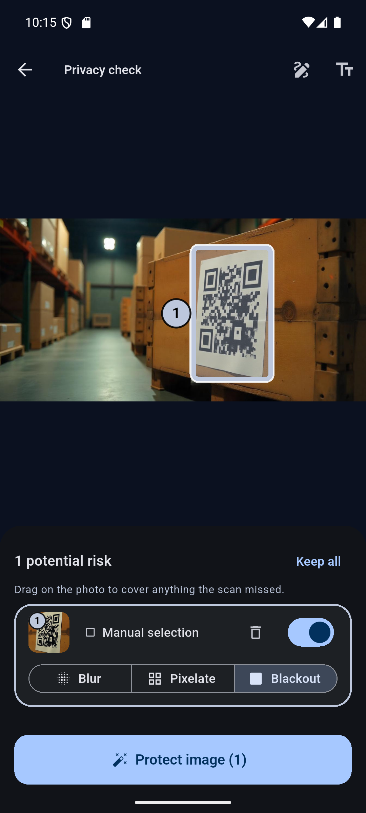

# Before You Post

**A privacy-first Android app that finds faces, personal details and QR codes in a photo entirely on-device, then lets you review and hide them before you share.**

Built with Flutter and Google ML Kit. No backend, no accounts, no image uploads.

---

## Screenshots

| Intro | Home | Analysis |
|:---:|:---:|:---:|
|  |  |  |
| Scan-pulse opening | Light theme | Per-detector progress |

| Findings — text | Findings — QR | Dark theme |
|:---:|:---:|:---:|
|  |  |  |
| Numbered boxes on exactly the sensitive spans | Decoded payload shown so you can judge it | Every screen themed from the same tokens |

| Picking one of many | Drawing your own | The protected copy |
|:---:|:---:|:---:|
|  |  |  |
| Tapping face 8 dims the other 19 and scrolls to its card | Covering a QR code the scan did not find | Rendered once from the original |

> The findings screenshots use a deliberate test image. The six items under **SHOULD BE FLAGGED** are all caught; the three under **SHOULD NOT BE FLAGGED** are all correctly ignored, including a 16-digit order number that fails the Luhn check. In the protected copy, note that "Call me at" and "Card" survive — only the sensitive spans are hidden, not the whole line.

---

## Status

**The MVP is complete.** Every step of the outline's definition of done works end to end: open the app, choose or take a photo, scan it on-device, review each finding, choose what to hide and how, draw your own box over anything missed, produce a protected copy, and save or share it.

The README says what actually works today rather than what is planned.

| Capability | State |
|---|---|
| Pick a photo from the gallery or camera | ✅ Working |
| Face detection | ✅ Working |
| OCR + rule-based detection of phone numbers, emails, URLs, card numbers, security codes, addresses, number plates, API keys and secrets | ✅ Working |
| QR and barcode detection, with decoded payload shown | ✅ Working |
| Review each finding and choose hide / keep | ✅ Working |
| Choose blur / pixelate / blackout per finding | ✅ Working |
| **Redaction — renders a protected copy** | ✅ Working |
| Light + dark themes, persisted | ✅ Working |
| Manual drag-to-redact for anything the scan missed | ✅ Working |
| Save to the gallery, or share via the system share sheet | ✅ Working |
| iOS support | ❌ Not configured (Android-only project) |

---

## The problem

A screenshot of a conversation can contain a phone number, a home address, a face and a QR code all at once. People share those images every day without noticing what is in the corner of the frame.

Existing tools either require uploading the image to a server — which is a strange thing to do with a photo you consider private — or leave the user to spot everything themselves.

**Before You Post** does the scan locally, shows what it found, and leaves the decision to the person holding the phone.

---

## How the detection pipeline works

Three independent detectors run **concurrently** on the same image, and their results merge into one list of findings.

```
                        IMAGE
                          │
        ┌─────────────────┼─────────────────┐
        │                 │                 │
  Face detection        OCR           QR / barcode
  (ML Kit)            (ML Kit)          (ML Kit)
        │                 │                 │
        │        Sensitive-text rules       │
        │        (regex + Luhn)             │
        │                 │                 │
        └─────────────────┼─────────────────┘
                          │
                   PRIVACY ENGINE
                          │
                    User review
                (hide / keep each item)
                          │
                  REDACTION ENGINE
                          │
                   Protected image
```

Two design decisions carry most of the weight:

**Reading text and judging text are separate problems.** `TextRecognitionService` knows how to read words and where they sit; it has no opinion about whether they are private. `SensitiveTextDetector` decides what is sensitive and never touches ML Kit. They fail in different ways and are debugged differently — an unflagged phone number is either an OCR miss or a rules miss, and those need opposite fixes. A debug-build-only toggle in the app bar draws every line OCR read, which tells you which of the two happened in about a second. It is gated behind `kDebugMode`, so it never reaches a release build.

**The rules are deliberately deterministic.** Regex plus validation, not a model. Rules are readable, unit-testable without a device, and explainable when they get something wrong. NLP is a later version, not a starting point.

The Luhn checksum is what makes card detection usable at all. Without it, "any 13–19 digit run" flags order numbers, timestamps and tracking IDs constantly. Every real card number satisfies Luhn and a random digit run passes only about one time in ten.

It also does a second job. ML Kit groups text into lines by proximity, and a card number is the one thing routinely printed with gaps wide enough that the four groups come back as **four separate lines** — at which point every per-line rule sees `1111`, which is not a card number by any measure and not a phone number either. `SensitiveTextDetector` therefore rejoins digit groups that share a row and sit close together, concatenates them left to right, and tests the result with Luhn. It accepts any run of digits rather than groups of exactly four, because the line grouping is inconsistent about where it breaks — the same card comes back as four groups on one photo and two halves of eight on another. Requiring the checksum is what stops that from inventing card numbers out of price columns and spreadsheets: a false join has to pass a one-in-ten filter rather than always succeeding. The union of the group boxes becomes the redaction bounds, because blacking out one quarter of a card number leaves the rest legible.

Detector ordering is load-bearing: a 16-digit card number **also** satisfies the phone-number pattern, so cards are tested first. There is a test pinning that behaviour so a future reorder fails loudly.

Security codes are the opposite case, and the one place where structure runs out entirely. Three digits have no shape: they are a price, a page number, a year, a quantity. Nothing distinguishes a card's security code from any of those except the word printed beside it, so the label **is** the rule — and because a card sets the label apart from the digits, OCR usually returns them as two separate lines. They are paired by position, and the box covers the digits rather than the label, since hiding the word "CVV" protects nothing. An unlabelled code is out of reach rather than merely difficult. The label matching is unanchored and also reassembles a "SECURITY" / "CODE" pair that OCR has split across two lines, because a card that prints the words stacked in small print produces exactly that — and neither half counts alone, "code" least of all.

Credentials are the highest-value thing in this list and the easiest to match, because the formats are issued rather than written: nothing in ordinary prose begins `AKIA` and continues for exactly sixteen more capitals. Provider prefixes cover AWS, Google, GitHub, Slack, Stripe, OpenAI and Anthropic keys, plus JWTs and PEM private-key headers. A second rule catches the formatless case — `API_KEY=...` in a screenshot of an `.env` file or a terminal — where the value is indistinguishable from noise and only the label says it matters. That rule uses a **lookbehind rather than ``**, because an underscore is a word character and `` never fires between `DB_` and `PASSWORD`, which silently missed every environment variable. A secret is also the one finding whose matched text is **not** shown in the review list; printing the key on screen would defeat the point of finding it.

Number plates use the same idea as Luhn — a cheap structural check that turns an unusable pattern into a usable one. Plate formats are shapes that ordinary text hits constantly: `ABC 1234` is also an order reference, a seat row and half the part numbers ever printed. What separates them is context, not shape. A plate is photographed as its own object, so OCR returns it as a short standalone line, and a match is only accepted when it accounts for **at least 60% of its line**. The same string inside a sentence is ignored. Requiring capitals costs nothing and removes a lot more.

Vanity plates defeat all of that, though, and a tester's photo proved it: `B2TRW` is a real Florida plate and matches nothing structural. So there is a second rule that reads the **line** rather than the characters — drop the words (`FLORIDA`, `TEXAS`, the issuing state), and if exactly one token is left, in capitals and digits with at least one of each, that is a plate. All digits is a quantity, all letters is a word, and that single condition is what keeps `Total 77002 units` and `London SW1A 1AA` out.

Addresses run three patterns rather than one: number-then-street (`1600 Pennsylvania Ave`), keyword-then-number (`House 12`, `Flat 3B`), and postcodes in the two forms distinctive enough to be worth matching. They overlap deliberately — `House 12, Road 5` matches two of them — so a match another longer match already covers is dropped, or the user gets two boxes over nearly the same words.

---

## Architecture

```
lib/
├── main.dart                        App shell, themes, first screen
├── models/
│   └── privacy_finding.dart         The one shared data type
├── screens/
│   ├── intro_screen.dart            Tap anywhere to continue
│   ├── home_screen.dart             Choose / take photo
│   ├── analysis_screen.dart         Per-detector progress
│   ├── editor_screen.dart           Image + overlays + review list
│   └── result_screen.dart           The protected copy
├── services/
│   ├── privacy_engine.dart          Owns and merges every detector
│   ├── face_detection_service.dart
│   ├── text_recognition_service.dart
│   ├── qr_detection_service.dart
│   ├── sensitive_text_detector.dart
│   └── redaction_service.dart       Renders the protected copy
├── theme/
│   ├── app_theme.dart               Colour, spacing and motion tokens
│   └── theme_controller.dart        Persisted light/dark choice
├── utils/
│   ├── geometry.dart                Drag-to-rect and screen-to-image maths
│   └── regex_utils.dart             Patterns + Luhn
└── widgets/
    ├── detection_overlay.dart       Draws the numbered boxes
    ├── finding_card.dart            One reviewable finding
    ├── finding_style.dart           Icon and colour per finding type
    ├── region_thumbnail.dart        Crop of a finding, for its card
    └── fade_slide_in.dart           Staggered entrance animation
```

**Screens talk to `PrivacyEngine`, never to a detector directly.** Adding QR detection to a working face + OCR pipeline required one new service file and a handful of lines in the engine — no screen, model or widget changed.

**No ML Kit type escapes its own service.** Each detector translates its library's result into `PrivacyFinding` and nothing leaks past that boundary. That is what will make it possible to swap in a YOLO model for licence plates later without touching the UI.

**Detection is assumed to be incomplete.** The crate photo in the screenshots above carries a QR code that ML Kit does not detect at all, and it is not an unusual case. Manual drag-to-redact (§21) is therefore not a nice-to-have: it is what keeps the app useful when the detectors are wrong, and it is why the empty state says "automatic checks are not perfect" rather than "you're safe".

**Findings are addressable, not just listed.** Twenty faces produce twenty rows all labelled "Face", which is unusable on its own. Each finding therefore carries a number drawn both on its box and on its card, and each card shows a thumbnail of the actual region cropped straight from the decoded image. Tapping a box on the photo dims the others and scrolls its card into view; tapping a card highlights its box. Without that, choosing which face to hide is trial and error.

**The redaction engine works from decoded pixels, not from the file.** It is handed the same RGBA buffer Flutter already decoded for display, rather than re-reading the image itself. Three things follow from that, and each was learned the hard way:

- It can protect **any format the phone can open** — AVIF and HEIC included, which `package:image` cannot decode at all. Decoding the file independently meant the app could display and analyse a photo it then refused to protect.
- A **palette (indexed-colour) PNG cannot silently defeat it.** In such an image a pixel holds an index, not a colour, so writing RGB into one changes nothing — redaction reported success and altered not a single pixel. There is no palette left by the time the engine sees the data.
- The pixels being edited are **byte-for-byte the ones the detectors measured**, so the two can never disagree about EXIF rotation.

### The invariant that matters

> `PrivacyFinding.bounds` is **always** in the original image's pixel coordinates — never screen or widget coordinates.

Every detector produces that space; only the drawing layer converts out of it. This is the single rule that keeps coordinate mapping tractable, and breaking it "just this once" is how half your rectangles end up in a different space with nothing in the type system to catch it.

The overlay avoids letterbox maths entirely by forcing the image container to the image's own aspect ratio with `AspectRatio`. With no black bars *inside* the box, the conversion collapses to one multiplication and zero offsets. `scaleX` and `scaleY` are still computed separately even though they are mathematically equal — if a future layout change breaks the aspect ratio, every box visibly **skews** rather than silently drifting.

---

## Technology stack

| Component | Choice | Why |
|---|---|---|
| Framework | Flutter 3.47.2 / Dart 3.13.2 | One codebase, good motion primitives |
| Face detection | `google_mlkit_face_detection` | On-device, free, no model to train |
| OCR | `google_mlkit_text_recognition` | On-device, returns text **and** its position |
| QR / barcodes | `google_mlkit_barcode_scanning` | Handles every common format, decodes the payload |
| Sensitive text | Regex + Luhn (hand-written) | Readable, testable, explainable |
| Image picking | `image_picker` | Gallery + camera, uses the Android photo picker |
| Redaction | `image` | Pure Dart, so the pixel work runs in an isolate |
| Sharing | `share_plus` | Hands the protected copy to the system share sheet |
| Saving | `gal` | Writes to the gallery via MediaStore |
| Preferences | `shared_preferences` | Theme choice only |
| Backend | **None** | See below |

Notably **not** used: `google_fonts`. It downloads font files from Google at runtime, which would contradict the "analysed on your device" line the app displays. If a custom typeface is added it will be bundled as an asset instead.

---

## Privacy design

The MVP performs all analysis locally. There is no upload, no account system, no analytics and no crash reporting.

The app's own wording is deliberately careful. The home screen says *"Photos are analysed on your device"* — a description of what it does — rather than *"your photos never leave your device"*, which is an absolute claim that would require auditing every dependency's behaviour first. ML Kit's models here run on-device, but that guarantee should be verified and stated precisely rather than assumed.

Findings are always described as **potential** risks. Automatic detection produces both false positives and false negatives, and an app that implies certainty is worse than no app: it teaches people to stop looking. Every finding is reviewable, nothing is hidden without an explicit choice, and the empty state says so out loud:

> *No potential risks found. Automatic checks are not perfect. Review the image yourself before sharing it.*

Defaults lean toward safety in both directions that matter:
- Findings default to **selected** (hide), so the cautious option is the default.
- When the rules cannot confidently identify which words a match covers, the redaction box falls back to the **whole line** — over-hiding is a cosmetic problem, under-hiding is a privacy failure.
- Text defaults to **blackout** rather than blur, because a blurred phone number has few enough possibilities to be worth attacking; faces default to blur.

---

## Running it

### Requirements

- Flutter 3.47+ ([install guide](https://docs.flutter.dev/get-started/install))
- Android Studio, for the Android SDK and emulator
- **NDK `28.2.13676358`** — install it via Android Studio → SDK Manager → SDK Tools → tick *Show Package Details* → NDK (Side by side)
- An Android device or emulator running **API 24+**

### Setup

```bash
git clone https://github.com/ALLEXCEED360/Before-You-Post.git
cd Before-You-Post
flutter pub get
flutter run
```

### Build a release APK

```bash
flutter build apk --release
```

### Troubleshooting

Two issues you may hit, both caused by the current Android toolchain rather than this project:

**`Process 'command sdkmanager.bat' finished with non-zero exit value -1073740791`**
Android's new CLI ships a `sdkmanager` compatibility shim that mis-parses package names containing a semicolon (it splits `ndk;28.2.13676358` into two bogus names) and then crashes. Gradle blames an innocent line in `android/build.gradle.kts`. **Fix:** install the NDK manually through Android Studio's GUI, as above, so Gradle never invokes the installer.

**A release build fails at R8, or builds and then crashes on every detector**
Two separate failures, and the first hides the second. R8 first aborts over ML Kit text recognisers for scripts the app does not use; once that is silenced it strips the classes ML Kit loads by reflection, so the APK builds cleanly and then throws `Attempt to invoke virtual method 'java.lang.Class java.lang.Object.getClass()' on a null object reference` on every scan. Both are handled by `android/app/proguard-rules.pro`, which is wired into the release build type. **Debug builds do not run R8 at all, so neither problem is visible until you build a release APK** - worth doing early rather than at ship time.

**`Could not close incremental caches ... compileDebugKotlin`**
Kotlin 2.4.0 incremental compilation fails on some Windows + JDK 25 setups and survives a `flutter clean`. Already handled in `android/gradle.properties` via `kotlin.incremental=false`. Plugin Kotlin sources never change, so this costs essentially nothing, and Dart compilation and hot reload are unaffected. Remove the line once the upstream bug is fixed.

---

## Testing

```bash
flutter test
```

66 tests, all running **in memory with no emulator**, in about two seconds.

**Detector tests (`test/split_card_test.dart`)** describe ML Kit results by hand. `OcrLine` is plain data, so a result the app cannot easily produce on demand — a card number the recogniser has broken into four lines — can simply be written down, along with the geometry that makes rejoining it correct or wrong.

**Unit tests (`test/sensitive_text_test.dart`)** cover the part most likely to be wrong and cheapest to check — the rules. Positive cases for every pattern, plus the negatives that matter:

- a valid card number is reported as a **card**, not a phone number (pins the detector ordering)
- a 16-digit run that fails Luhn is **not** a card
- `2024-01-15` is **not** a phone number
- ordinary prose produces nothing

**Widget tests (`test/widget_test.dart`)** cover layout regressions that are invisible during normal development:

- dark mode renders without throwing
- the layout survives **2.0× system text scale**, roughly Android's maximum accessibility font size
- the three redaction-method labels stay on one line in a narrow card at 1.3× text scale
- a whole finding card fits inside the review panel on a 360×740 screen

The panel-height test exists for the same reason. The editor used a fixed 3:2 split between photo and review panel, and on a shorter phone 40% was no longer enough for a single card — a tester's screenshot showed one card clipped through its own thumbnail. The panel is now sized by its content up to a ceiling, and the test asserts the first card sits entirely inside the viewport. It fails against the old split by 66px, which is the point of writing it that way round.

The method-label test exists because that one shipped: on a narrower phone than the one this was developed on, "Pixelate" and "Blackout" each broke across two lines mid-word. Nothing threw — text wrapping is legal layout — so the test measures the rendered height instead of watching for an exception.

That text-scale test has already caught two real bugs — a `Spacer` overflowing inside a scroll view, and a later fix where the tagline silently grew until it overlapped the tap prompt. Both were invisible at default text size.

Note that neither suite uses `pumpAndSettle`: the intro rings and the home-screen halo animate forever, so "wait until nothing is animating" never becomes true. The tests pump a fixed duration instead.

### Manual test set

Detection accuracy still needs real images. A useful set covers: a portrait with one face; several faces; a screenshot with a phone number; one with an email; one with a URL; a QR code; an image with several risk types at once; an image with **no** sensitive information; text that resembles a phone number but is not one; rotated images; very large and very small images; and low-light or low-quality photos.

For each, check both that detection is correct **and** that the box lands on the right pixels.

Detector robustness has not been measured systematically yet. Flat, well-lit QR codes and clear text are detected reliably; how far accuracy falls off with angle, blur, glare or low light is currently unknown for all three detectors, and worth quantifying before making any claim about it. Verify that a test image is itself valid before treating a miss as a detector weakness — an unreadable code proves nothing.

---

## Known limitations

These are measured, not hypothetical.

- **Blur and pixelation are weaker than blackout.** Both are lossy but not destructive, and against a short, guessable value such as a phone number they are a softer guarantee than a solid block. That is why text defaults to blackout and only faces default to blur. An early blur radius left phone numbers readable in testing; it is now far more aggressive, and a test pins that strength.
- **The universal APK is about 117 MB**, carrying every ABI plus ML Kit's bundled models. The app bundle shipped to Play is 80.9 MB and installs at **24 MB** on a given device, because Play delivers only the matching ABI and density. Sideloading the universal APK is the expensive path, not the normal one.
- **The protected copy is always re-encoded from raw pixels**, so a palette PNG comes back as a full-colour PNG and is larger than the original, and an AVIF or HEIC input comes back as JPEG. Correctness and format support over file size.
- **One finding type per line of text.** A line containing both an email and a phone number reports only the email. Drawing a box by hand is the escape hatch.
- **Address detection is still rules, not understanding.** It covers number-then-street, keyword-then-number and two postcode forms, which between them reach well beyond the original US-only rule — but it recognises shapes, not places, and an address written in a shape none of the three anticipate is invisible to it.
- **Phone-number detection is US-centric** and will flag some non-phone digit sequences of the right shape. This is why every finding is labelled *potential* and is reviewable.
- **English/Latin script only.** The OCR model loaded is the Latin recogniser.
- **Number plates are read, not seen.** They are found by OCR plus rules, not by locating a plate in the image, so a plate has to be legible as text to be found at all. A plate too small, too angled or too stylised for the recogniser is invisible to this, and no rule can help. Non-Latin plates cannot be read at all, which rules out Bengali and Devanagari ones.
- **Secret detection is prefix-based, so a bespoke credential format is missed** unless it is labelled. An internal token that is neither recognisably issued nor written as `SOMETHING_KEY=` will not be found.
- **An unlabelled security code cannot be found.** If the card does not print `CVV` or `CVC` legibly next to the digits, or OCR does not read that word, there is nothing to match on — three digits are indistinguishable from any other three digits. Expiry dates are not detected at all yet, for the same reason.
- **Objects cannot be detected, only faces, text and codes.** A physical key, a document held in shot, a name badge — none of these are findable, because recognising them needs an object-detection model and ML Kit's classifies into five coarse categories that cover none of them. The manual tool is the honest answer for anything in this class.
- **Android only.** iOS builds require macOS and the project has no `ios/` target configured.

---

## Roadmap

The MVP is finished, so everything below is genuinely optional.

**Later**
- Licence-plate detection with a YOLO model
- Better address detection using NER
- IDs, passports, tickets and financial documents
- Share-sheet integration, so an image can be sent *into* the app from any gallery or social app
- Live camera mode, highlighting risks in the viewfinder before the shutter

---

## Licence

No licence has been chosen yet, so default copyright applies. An MIT licence is planned.
